<head>
</head>

<body>
<h1> Watch Out </h1>

  It is a Project which is divided into 2 parts, So the main Moto behind this which is why we develop this  app is That Every day now we are facing issues related to Women Rape Violence and much more. also some issues similar to one which is depicted in <b>URI</b> movie where Vicky Kaushal mom has a Problem because of which she forgets everything and ran out somewhere. So here we have developed a solution through which user can track there family member Via Google Map and not only that user can also Ask for help to Police which is the other app if wanted, by just clicking on a button and police will get the exact coordinated in real time.
  

  <h3> Other Features</h3>
  <li>Give position to family Members </li>
  <li>Chat</li>
  <li>Location Tracking</li>
  <li>Alert Police</li>
  <li>Real Time Location tracking  </li>
  <li>Chat with Doctor </li>
  <li>Map</li>
  <li>Alert Emergency Contact</li>
  <li>Asking Police to Track You In Real Time</li>
  <li>Safety Tips</li>
  <li>Add Updates</li>
  <li>Call Emergency Contact</li>
  <li>Chat With Friends </li>
  <li>Ask Doctor</li>
  <li>News Section - to Enlighten Yourself with Surrounding</li>
  <li> Social Media Friendly</li>
   
   To Download App 
  <a class = "Link" href="https://drive.google.com/drive/folders/11sf2gr55_PnhRbZzIUIMLCWhie1TZu7F?usp=sharing"> Link</a>
   
  
   
  
</body>

 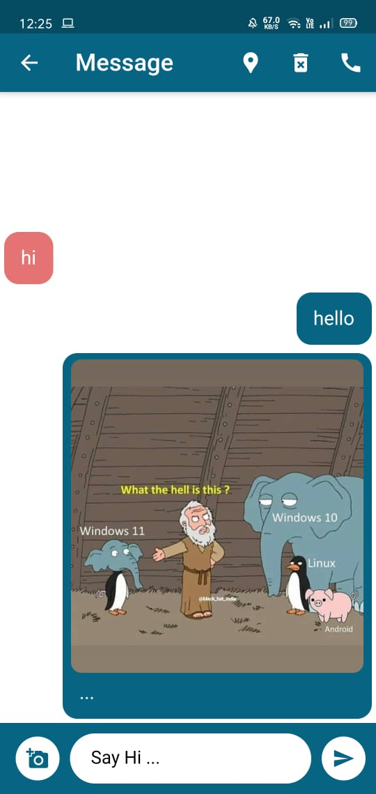  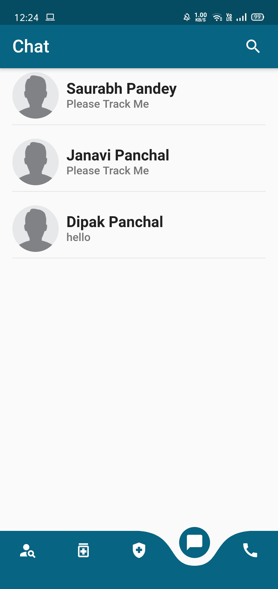 
    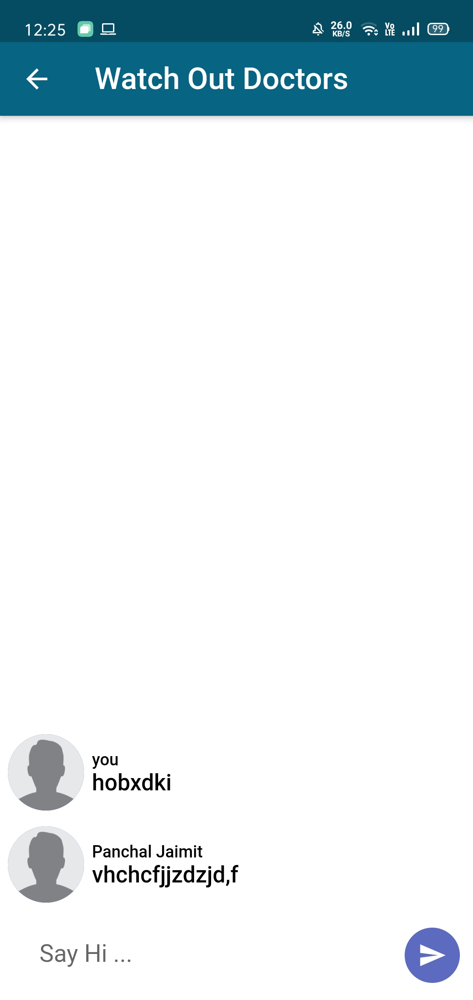 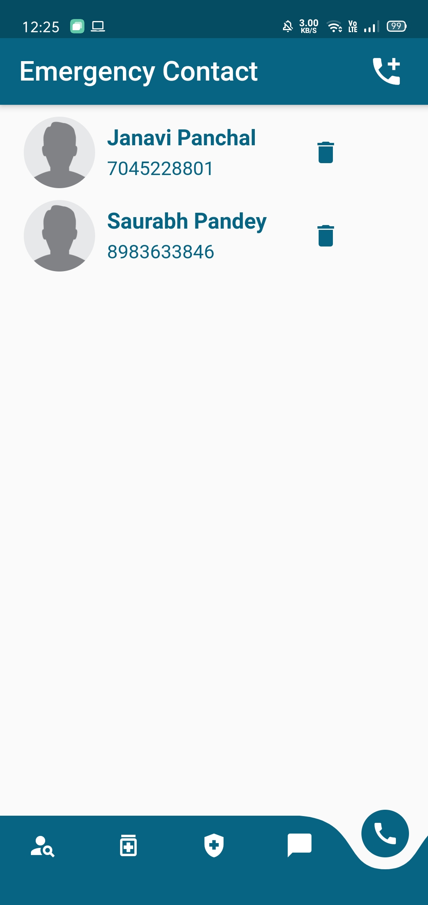 
    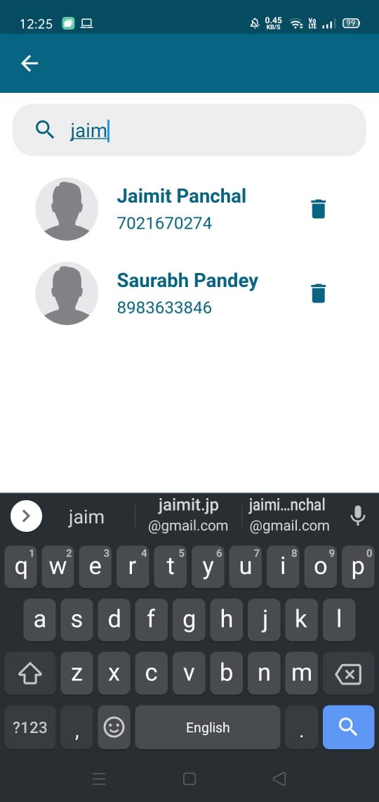 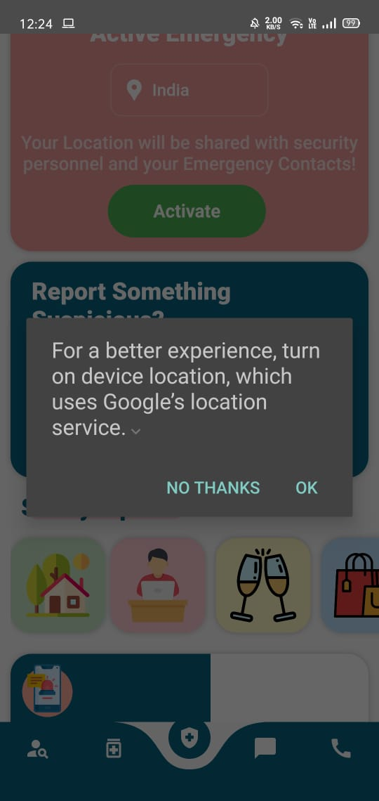 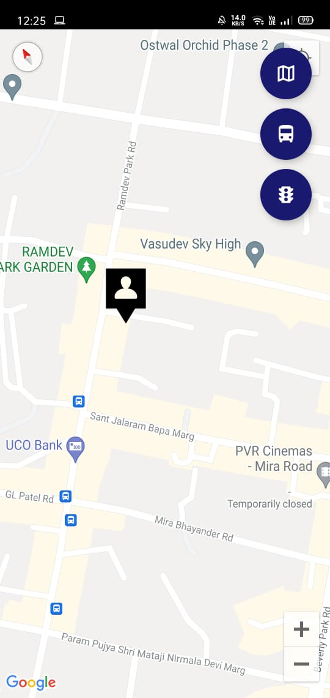   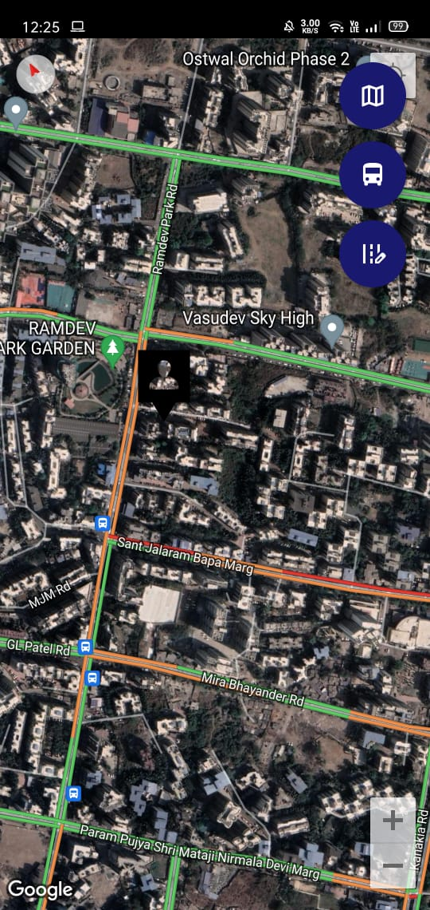 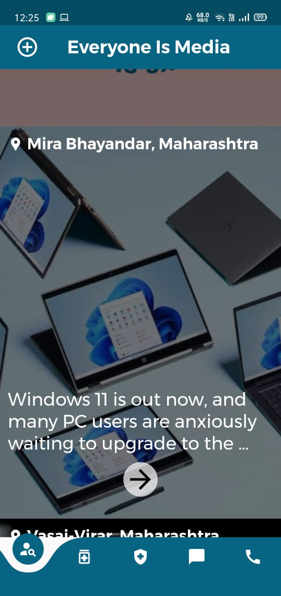 
     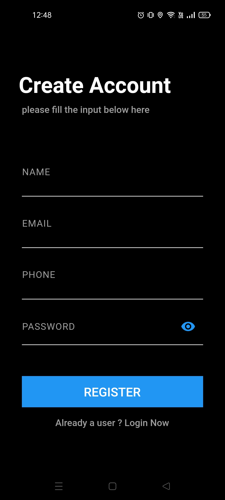 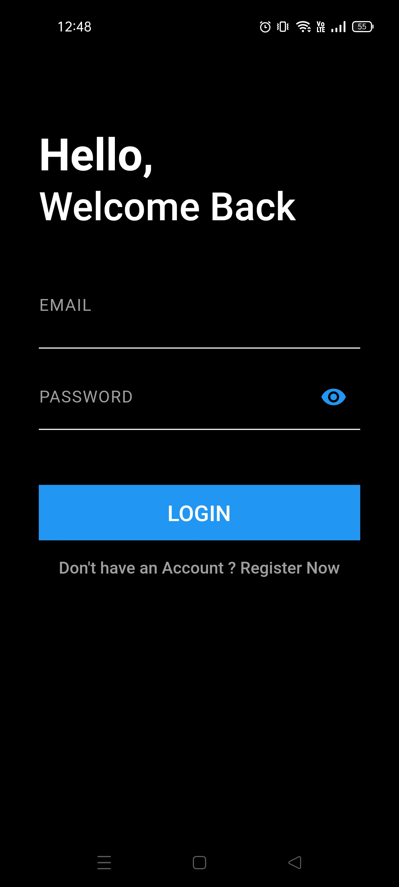 
    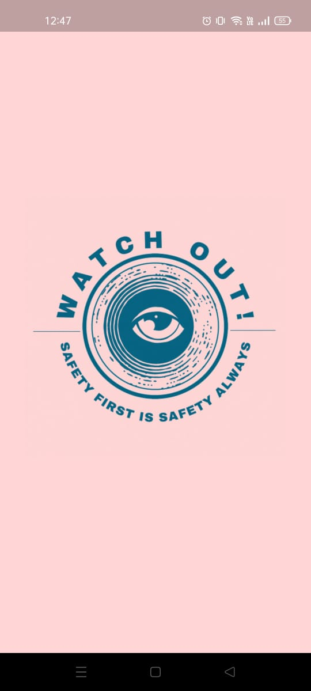  
    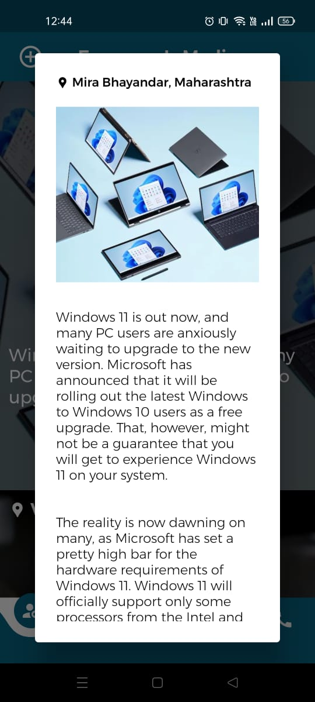
    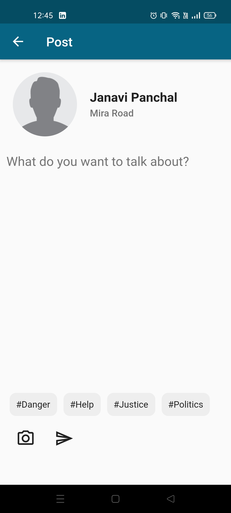 
    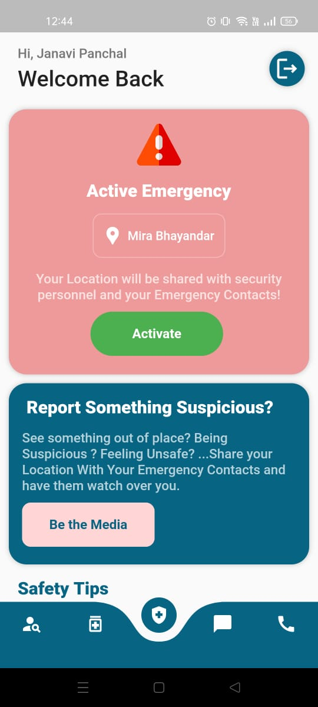 
